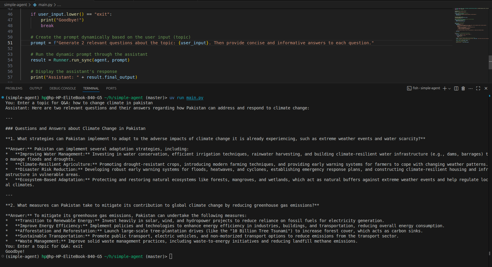
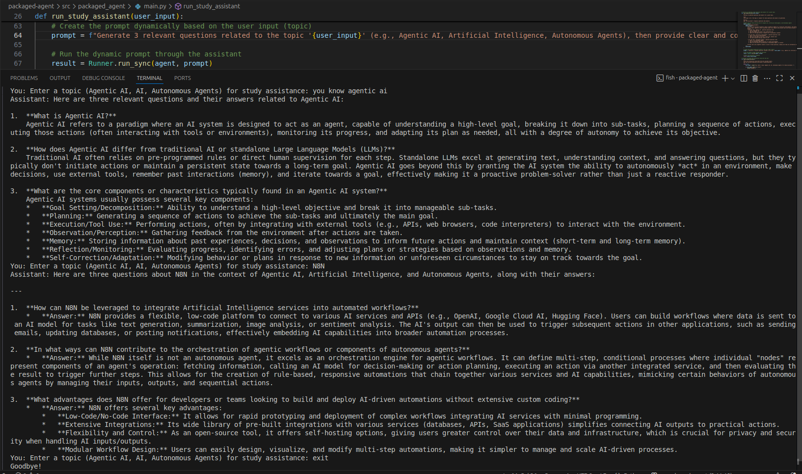

# Hello, Agent Assignment

This project implements two minimal Python apps using the OpenAI Agents SDK. The apps demonstrate how to create agents that interact with the user and generate responses dynamically based on a topic input. Each agent prints a greeting generated by the model, as specified in the assignment guidelines.

## Project Structure

```
hello-agent-assignment/
├─ simple-agent/               # uv simple application
│  ├─ main.py                  # Runs a minimal agent that prints a greeting
│  ├─ pyproject.toml
│  ├─ README.md                # This file
│  ├─ .env                   # Contains GEMINI_API_KEY= (no real key)
│  └─ .venv/                   # Auto-generated, do not commit
└─ packaged-agent/             # uv packaged application (src layout)
   ├─ pyproject.toml
   ├─ README.md                # This file
   ├─ .env.example             # Contains GEMINI_API_KEY= (no real key)
   └─ src/
      └─ packaged_agent/
         ├─ __init__.py
         └─ main.py            # Exposes a run function (CLI entry point)
```

## Setup Instructions

1. Clone the repository to your local machine.
2. Navigate to the `hello-agent-assignment/` directory.
3. Create a `.env` file with your `GEMINI_API_KEY`:

```env
GEMINI_API_KEY=your_api_key_here
```

4. Install dependencies by running:

```bash
uv sync
```

5. To run the simple agent, execute:

```bash
uv run file-path
```

6. To run the packaged agent, execute:

```bash
[project.scripts]
- packaged-agent = "packaged_agent:main"
- agent = "packaged_agent.main:start_study_assistant"
- uv run agent
```

## Explanation of the Bot's Functionality

### Simple Agent

The **simple agent** is a minimal Python script designed to interact with the **OpenAI Agents SDK**. When the user provides a topic, the agent generates relevant questions and answers dynamically based on the provided prompt.

## Functionality

The simple agent generates **two questions** and their corresponding answers based on the user's input. For example, if you input a topic like "how to change climate in Pakistan," the agent will return two related questions and answers, as shown in the terminal screenshot below.

## How it Works

1. The agent receives a user input.
2. It uses the OpenAI Agents SDK to generate relevant questions and answers based on that input.
3. The output is printed dynamically in the terminal, without relying on hardcoded text.


**Terminal Screenshot:**



---

### Packaged Agent

The **packaged agent** is a more structured version of the simple agent. It includes multiple Python files and organizes the agent’s code in a `src/` directory. This agent runs similarly to the simple agent but is packaged for use in more complex applications. It exposes a callable in `src/packaged_agent/main.py` to facilitate running via the CLI.

### Functionality

The packaged agent is designed to offer more flexibility and scalability. It organizes the agent’s components into separate files for better management and easier deployment in larger systems. This version uses the same OpenAI Agents SDK but is structured for integration into more complex applications that require modularity.

### How it Works

1. The agent receives user input through the command-line interface (CLI).
2. It uses the OpenAI Agents SDK to generate relevant questions and answers based on that input.
3. The response is printed dynamically, much like the simple agent, but with a more complex structure.


**Terminal Screenshot:**



---

## Git Instrunction

* `.env` is included for your reference, but **do not commit real API keys**.
* The `.env` file containing sensitive information is **excluded** from version control by the `.gitignore` file.

